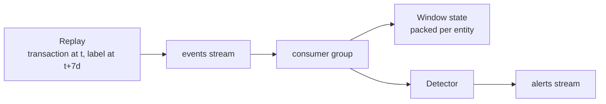

# Fraud Stream Detection

Scores card transactions and ranks them for a review team that can work a fixed
number of alerts a day. Over an 85-day held-out period, 62 of every 100 alerts are
fraudulent, against 0.7 for the same queue in arbitrary order.


## Corpus

The transactions come from the simulator published with the Fraud Detection
Handbook (Le Borgne and Bontempi, Université Libre de Bruxelles), one file per
simulated day, downloaded without authentication.

| | |
|---|---:|
| Transactions | 1,754,155 |
| Frauds | 14,681 |
| Fraud rate | 0.837% |
| Period | 2018-04-01 to 2018-09-30 |
| Customers | 4,990 |
| Terminals | 10,000 |

A simulator is used rather than a public fraud dataset because the two public ones
carry no entity identifier. The features this system exists to compute are
windowed per card and per terminal, and a table of anonymised principal components
cannot express them.

Every fraud carries the scenario that produced it, and the three differ in what
makes them visible.

| Scenario | Frauds | Signature |
|---|---:|---|
| 1 | 973 | Every amount above 220, and no legitimate transaction reaches it |
| 2 | 9,077 | 357 terminals compromised for a median of 26 days, at amounts averaging 53.81 against 52.98 for legitimate traffic |
| 3 | 4,631 | 487 cards compromised for a median of 11 days, at amounts averaging 260.92 |

Scenario 2 is 62% of all frauds and its transactions are indistinguishable from
legitimate ones by amount. That is what places a ceiling on any detector fitted
without labels, and reporting recall per scenario rather than one aggregate is
what makes the ceiling visible.

## Features

Eighteen features per transaction: the amount, the hour, a weekend flag, and
rolling counts and mean amounts per customer and per terminal over 1, 7 and 30
days, plus the ratio of the amount to the customer's window mean.

Every window is prior-only. A scorer running on an arriving transaction has not
seen that transaction, so including it in its own window would report a quality
the live path cannot reach.

The ratio is regularised by one currency unit. Forty-two transactions carry an
amount of zero, and a customer whose window contains only those produces an
unbounded ratio under a plain division, which reached 7.65e7 and a standard
deviation of 72,144 across the table.

Features derived from past labels live in a separate module. A label arrives when
a dispute resolves, not when the transaction happens, so every risk window ends
seven days before the transaction it describes, expressed as the difference of two
windows that end now. The evaluation refuses to run a detector that declares
itself label-free while reading one of those columns.

## Evaluation protocol

The detector is fitted on 2018-04-01 to 2018-06-30 and scored on 2018-07-08 to
2018-09-30. The week between them is the delay a label takes to come back.

| | Rows |
|---|---:|
| Training period | 872,795 |
| Held-out period | 813,843 |

Accuracy is meaningless at 0.837% positives, and so is a global threshold. A team
works a fixed number of alerts a day, so the metric is precision at that depth,
measured per day and averaged.

Card precision is reported alongside it because a team investigates cards, not
transactions. Three alerts on one compromised card are one investigation, and
transaction precision counts them as three hits.

## Detector comparison

| Detector | Labels | Card p@100 | p@20 | p@50 | p@100 | p@200 | Recall s1 | Recall s2 | Recall s3 |
|---|:---:|---:|---:|---:|---:|---:|---:|---:|---:|
| `random` | | 0.026 | 0.008 | 0.007 | 0.007 | 0.008 | 0.009 | 0.009 | 0.008 |
| `amount` | | 0.183 | 0.863 | 0.397 | 0.209 | 0.112 | **1.000** | 0.011 | 0.576 |
| `deviation` | | 0.219 | 0.898 | 0.479 | 0.266 | 0.141 | 0.909 | 0.007 | 0.815 |
| `isolation_forest`, 18 features | | 0.186 | 0.631 | 0.354 | 0.212 | 0.124 | 0.417 | 0.007 | 0.707 |
| `isolation_forest`, 4 features | | 0.218 | 0.671 | 0.428 | 0.265 | 0.142 | 0.998 | 0.008 | 0.791 |
| `supervised`, label-free features | ✓ | 0.226 | 0.946 | 0.540 | 0.286 | 0.148 | 0.982 | 0.007 | 0.878 |
| **`supervised`, with delayed risk** | ✓ | **0.561** | **0.972** | **0.900** | **0.620** | **0.329** | 0.916 | **0.664** | 0.819 |

Those figures rank each completed day and take its best hundred, which a service
cannot do: it decides on a transaction when it arrives, with no view of the rest of
the day. What it can do is compare the score against a fixed operating point, and
that is measured separately.

| | Alerts a day | Precision |
|---|---:|---:|
| Ranking each finished day, top 100 | 100 | 0.620 |
| **Fixed operating point** | **120** | **0.532** |

Reporting only the ranked figure overstates the served result by 0.088. The
operating point also overshoots its budget: it is a quantile of the training
scores, and the score distribution moves over the following months, so the same
threshold emits between 94 and 146 alerts a day with a median of 119. An operating
point set once and never revisited drifts, and both numbers are recorded beside
the model rather than left to be discovered in production.

`amount` ranks by the amount alone, which is the rule a fraud team writes first.
It recovers scenario 1 completely, since the simulator places every scenario-1
fraud above a threshold no legitimate transaction reaches.

The isolation forest over all eighteen features scores below ranking by a single
one. Restricting it to the amount and the three deviation ratios raises p@100 from
0.212 to 0.265 and scenario-1 recall from 0.417 to 0.998. An isolation score
measures rarity across every dimension it is given, and terminal activity and hour
of day are rare in ways unrelated to fraud, so each uninformative dimension
dilutes the signal. Dropping the six terminal features alone recovers 0.254.

No label-free detector exceeds 0.011 recall on scenario 2, which is chance at this
budget. Delayed labels are the only thing that sees it: the terminal risk of a
scenario-2 fraud averages 0.612 against 0.005 for legitimate traffic, and adding
the twelve risk columns takes scenario-2 recall to 0.664 and p@100 from 0.286 to
0.620.

## Streaming

Transactions and resolved labels travel on one Redis stream, read by one consumer
group. Their relative order carries meaning: a label describes a transaction the
scorer has already judged, and a risk window may only contain outcomes that had
resolved by the time the transaction it describes arrived. Two streams read in one
call are ordered per stream, not by time, so a batch could hand a consumer a label
before the transaction it belongs to.



The consumer reads the windows, scores, and only then records the transaction, so
a transaction is never part of the history it is judged against. That ordering is
the streaming half of the prior-only property the batch path gets from
`closed="left"`, and `tests/test_parity.py` asserts the two produce the same
eighteen numbers over a replayed sequence, and the same twelve risk numbers over a
sequence with its labels released on the delay.

The alert threshold is a quantile rather than a probability. A review team is a
rate, so training writes the score above which the expected alert rate equals the
daily budget: 0.016430 over the 91 training days.

Replaying one simulated day of the held-out period against warm state produces 120
alerts, of which 63 are fraudulent. That sits between the offline p@100 of 0.620
and the p@200 of 0.329, which is what a budget of 120 should give.

| | |
|---|---:|
| Events replayed | 18,918 |
| Alerts | 120 |
| Precision on those alerts | 0.525 |
| Per-event latency p50 | 1.72 ms |
| Per-event latency p95 | 2.26 ms |

The producer paces itself against the consumer rather than against the clock alone.
It emits at a configured multiple of simulated time, and waits whenever the group
has more than 5,000 entries it has not read. The stream is capped, so a producer
that stays further ahead than the cap does not queue work, it discards it: the
oldest unread entries are trimmed to make room for the newest.

The rate that matters is not the one configured. Measured on the deployment, the
consumer advances simulated time at about 250 times real time, against the 600 the
producer was set to, because Redis and PostgreSQL are a network hop away there and
are not on the same machine. With the throttle the configured figure becomes a
ceiling and the replay runs at whatever the consumer sustains. Driven by a producer
with no rate limit at all, it held back 41 seconds over 37,834 events and the group
read every one of them.

Lag is read from the consumer group, and Redis reports it as unknown once entries
have been trimmed. That reads as no backlog if it is taken for zero, which would
disable the throttle exactly when the stream is full, so it is treated as unknown
and the producer does not throttle on a figure it does not have.

The same replay against an empty Redis produces 37 alerts. A consumer that starts
cold scores its first transactions against no history, which is a property of the
restart and not of the traffic, so the state that precedes a replay is loaded
before it begins.

## Window state

A window is one packed binary string per entity: four bytes of timestamp and four
of amount for a transaction, four and one for an outcome. A sorted set expresses
the same window and costs 33.4 bytes an entry against 8.

| | Sorted sets | Packed strings |
|---|---:|---:|
| Redis resident | 33.22 MB | **11.91 MB** |
| Window and risk keys | 29.4 MB | **9.59 MB** |
| Load of 288,163 transactions and 287,618 labels | 107 s | **1.1 s** |

The 25 MB a free key-value instance offers is what makes the encoding a decision
rather than a preference. The loading time is a separate result: the packed form
is built once per entity and written in one command, where the sorted set was
filled a transaction at a time.

Reading is unaffected by the change, since both paths already read the whole
window. A customer holds a median of 61 entries over thirty days and a terminal 28,
so the window a scorer parses is small enough that filtering it in process costs
less than asking Redis for a range.

## Alert queue

An alert is persisted as one row per transaction placed above the operating point.
A consumer group delivers at least once, so the insert ignores a transaction
already in the queue, and the acknowledgement happens after the write: a crash
between the two redelivers the message rather than dropping the alert.

The outcome column is the resolved label. A replay knows it because the corpus
carries it, and a live deployment fills it when the dispute resolves, which is why
it is nullable rather than part of the insert.

Paging is by cursor on the identifier rather than by offset. The queue grows while
it is read, and an offset page skips or repeats rows as it does.

## Endpoints

| Endpoint | Purpose |
|---|---|
| `GET /alerts` | The queue, newest first, paged by cursor |
| `GET /stats` | Volume, precision over resolved alerts, latency and the scenario split |
| `WS /live` | Alerts as they are raised |

The socket reads from the end of the alert stream, so it carries what arrives while
it is open, and the backlog is what `GET /alerts` is for. Latency percentiles are
read over the recent tail rather than the whole table, since the panel reports a
session and not the lifetime of the queue.

The deployment reaches what the fixed operating point predicts. Over the first
days of a replay it reported 517 alerts at 0.474, against the 0.532 the same
threshold gives across the whole held-out period.

One replayed day of the held-out period, through the API:

```json
{
  "alerts": 120, "resolved": 120, "frauds": 63, "precision": 0.525,
  "latency_p50_ms": 1.74, "latency_p95_ms": 2.59,
  "by_scenario": {"0": 57, "1": 6, "2": 28, "3": 29}
}
```

Fifty-seven of the 120 are false alarms, and the 63 that are not divide into 28
compromised terminals, 29 compromised cards and 6 above the amount rule. Scenario 2
is what the delayed labels buy: no label-free detector reaches it.

The free tier gives one service, so the scorer runs in a thread beside the API and
the same code runs as separate processes locally. `RUN_CONSUMER` and `RUN_REPLAY`
are what select the shape.

## Client

A Next.js panel over the same two endpoints and the socket. The backlog is fetched
once and the socket carries what arrives after it, which is the division the
endpoints already draw.

The queue returns numbers and the stream returns strings, since Redis fields are
text. Both are read into one shape before anything renders, and a test asserts the
two produce the same alert, so the table never branches on where a row came from.

An arriving alert is merged by transaction rather than appended. A consumer group
delivers at least once, and a redelivery would otherwise show the same alert twice.

A closed socket is reopened rather than reported. A free instance sleeps, so a
disconnection is the normal state of an idle demo and not a fault to surface.

```bash
cd web
npm install
NEXT_PUBLIC_API_URL=http://localhost:8000 npm run dev
```

The socket URL is derived from that origin and its scheme is raised with it: a page
served over https cannot open a `ws://` socket, so `https` becomes `wss`.

## Running it

```bash
python -m venv venv && source venv/bin/activate
pip install -r requirements.txt

python -m ingest.prepare        # downloads 183 days and builds the table
python -m evaluation.offline    # fits every detector and prints the comparison
```

Ingestion takes about 20 seconds and caches the day files, so a repeated run
downloads nothing. The comparison takes about 70 seconds, most of it the two
isolation forests scoring 813,843 rows.

The streaming path needs Redis, PostgreSQL and the fitted detector.

```bash
docker compose up -d
alembic upgrade head
python -m detect.train          # writes the model and its threshold
python -m stream.warmup         # loads the state preceding the replay

python -m stream.consumer &     # scores, persists and emits alerts
python -m stream.producer --days 1
uvicorn api.main:app --port 8000
```

## Deployment

| Component | Host |
|---|---|
| API, scorer and replay | Render |
| Alert queue and replay corpus | Neon, PostgreSQL |
| Window state and event stream | Render Key Value |
| Detector | Hugging Face model repository |
| Panel | Vercel |

The free plan gives one service, so the scorer and the replay run as threads beside
the API. `RUN_CONSUMER` and `RUN_REPLAY` select that shape, and the same code runs
as separate processes locally.

Neither the corpus nor the detector is in the repository. A free instance has no
persistent disk, so the 103 MB of day files a local run downloads would be fetched
again on every restart. The rows a replay and its warm-up need are loaded into
PostgreSQL once, and the fitted detector is published as a model repository whose
card is generated from the run that produced it, so the documented metrics and the
recorded fit cannot diverge.

| | |
|---|---:|
| Replay slice | 421,807 rows, 46 MB |
| Detector | 71 KB |
| Slice read and warm state | 2.7 s |
| Resident | 304 MB |
| Peak | 326 MB |

The slice is read in pieces of 25,000 rows. The frame it produces holds 13 MB, and
materialising it in one query costs 456 MB while it is built, which alone exceeds
what the plan allows. Streaming it holds the transient to 187 MB and is no slower.

Memory is flat through a replay. The peak is the startup, and scoring adds nothing
to it: a window is a packed string of at most a few hundred bytes, read whole and
filtered in process, so no request allocates in proportion to the corpus.

The serving install carries neither the parquet reader nor the downloader, since
the deployment reads its slice from PostgreSQL and never touches a file. That is
485 MB against 641 MB, and the split is what `requirements-offline.txt` names.

```bash
# Once, against the target database.
alembic upgrade head
python -m tools.publish_corpus --start 2018-07-08 --days 7

# Once, after fitting.
python -m detect.publish
```

The detector is a pickle and executes on load. The model repository is the trust
boundary, and `MODEL_REPO` should name one the deployment controls.

## Development

```bash
pip install -r requirements-dev.txt

pytest                    # 67 tests, offline
alembic upgrade head
pytest -m postgres        # 3 more, against a live database
ruff check .
```

No test in the default run reaches the network, the corpus or a database. The
window tests assert the prior-only property on hand-built frames of two
transactions, where the expected value is arithmetic rather than a recorded output,
and the endpoint tests run against an in-memory database through an injected
session.

Three tests are held back because they depend on PostgreSQL rather than on SQL: the
insert that ignores a redelivered alert is written in the dialect that has it. CI
applies the migration and runs them against a service container.

The client carries thirteen tests over the shape conversion, the socket URL and the
feed merge, and CI runs them alongside its lint, type check and build.

## Project structure

```text
Fraud-Stream-Detection/
├── ingest/
│   ├── config.py         # Source, cache paths and the period split
│   ├── download.py       # Day files, cached and resumable
│   ├── prepare.py        # Day files to one time-ordered table
│   └── source.py         # The replay slice, from the file or the database
├── features/
│   ├── config.py         # The feature contract shared by every path
│   ├── offline.py        # Label-free windows, computed in batch
│   ├── online.py         # The same windows, computed from packed Redis state
│   └── risk.py           # Windows over past labels, ending before the delay    # The same windows, computed from packed Redis state
├── detect/
│   ├── config.py         # Model settings
│   ├── detectors.py      # Baselines, isolation forest and the supervised model
│   ├── train.py          # Fits the served model and its alert threshold
│   ├── artifact.py       # Local export, or the model repository
│   └── publish.py        # Uploads the fit with a card built from it
├── stream/
│   ├── config.py         # Stream names, consumer group and replay rate
│   ├── events.py         # The wire format
│   ├── producer.py       # Replays transactions and releases labels on the delay
│   ├── consumer.py       # Consumer group and scoring
│   ├── sinks.py          # Where a raised alert goes
│   └── warmup.py         # Bulk load of the state preceding a replay
├── api/
│   ├── config.py         # Origins, and which workers this process runs
│   ├── main.py           # The queue, the summary and the live socket
│   ├── broadcast.py      # Alert stream to open sockets
│   ├── deps.py           # Request-scoped session
│   └── schemas.py        # Response models
├── db/
│   ├── models.py         # The alerts table
│   ├── alerts.py         # Reading and writing the queue
│   └── session.py        # One engine for the process
├── alembic/              # Migrations
├── tools/
│   └── publish_corpus.py # Loads the replay slice into PostgreSQL
├── web/
│   ├── app/page.tsx      # The panel, its socket and the summary poll
│   ├── components/       # Summary cards and the alert table
│   └── lib/              # Shape conversion, socket URL and the feed merge
├── evaluation/
│   ├── config.py         # Review budget
│   ├── metrics.py        # Precision at k, card precision, recall per scenario
│   └── offline.py        # The comparison, with the label-free guard
└── tests/                # pytest suite, offline
```
